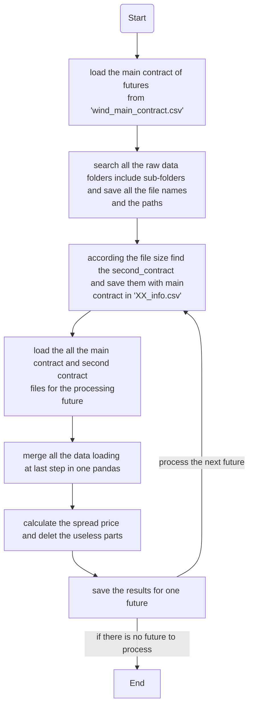
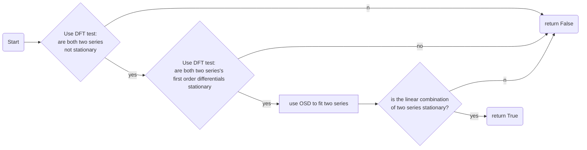

### Flow chart for data cleaning

```mermaid
flowchart TD
    A(Start);
    A-->B[load the main contract of futures \nfrom 'wind_main_contract.csv'];
    B-->C[search all the raw data folders include sub-folders \n and save all the file names and the paths];
    C-->D[according the file size find the second_contract \n and save them with main contract in 'XX_info.csv'];
    D-->E[load the all the main contract and second contract\n files for the processing future ];
    E-->F[merge all the data loading at last step in one pandas];
    F-->G[calculate the spread price and delet the useless parts];
    G-->H[save the results for one future];
    H-->| process the next future |D;
    H-- if there is no future to process -->M;
    M[End];
```

```mermaid
flowchart LR
    A(Start);
    A-->B{Use DFT test: \nare both two series\n not stationary};
    B--no-->M;
    B--yes-->C{Use DFT test: \nare both two series's \nfirst order differentials stationary};
    C-- no -->M;
    C--yes-->D[use OSD to fit two series];
    D-->E{is the linear combination \nof two series stationary?};
    E--no-->M;
    E--yes-->N;
    M(return False);
    N(return True);
```

