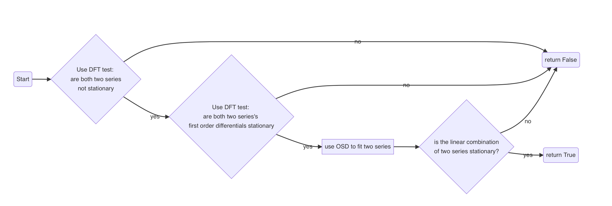

## Co-integration analyst

In pair trading, co-integration analyst is very important. Only if two series have the character of co-integration, they can use the way of pair trading. This page I will record the way I use in the co-integration analyst.

### Stationarity

About the meaning of the stationarity we can see the page: https://en.wikipedia.org/wiki/Stationary_process. In this page, if we two series are co-integration series, a linear combination of them must be stationary (vice is not). So stationarity test is very important for two series.

And in the python, I use the unit root test to check whether a series is stationary. And the way of unit root test is the DFT(we can reference: https://en.wikipedia.org/wiki/Dickey%E2%80%93Fuller_test).

### Co-integration test for two series

In the python code, the flow to test two price series of futures' contracts is :

 

## References

https://en.wikipedia.org/wiki/Stationary_process

https://en.wikipedia.org/wiki/Dickey%E2%80%93Fuller_test

https://zhuanlan.zhihu.com/p/21566798
