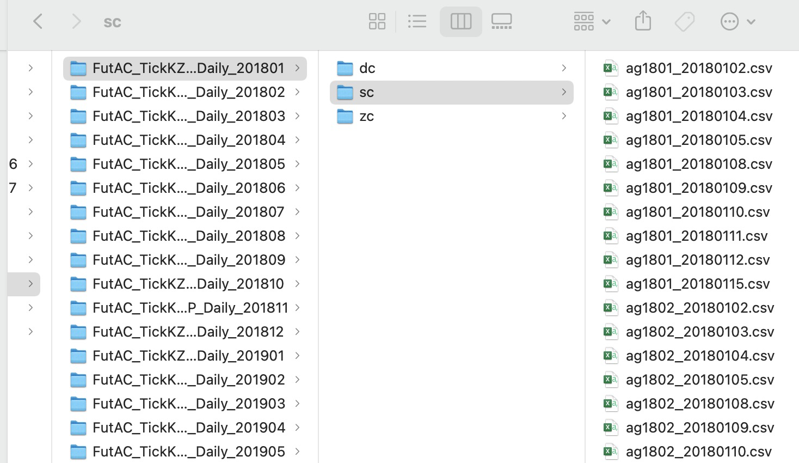
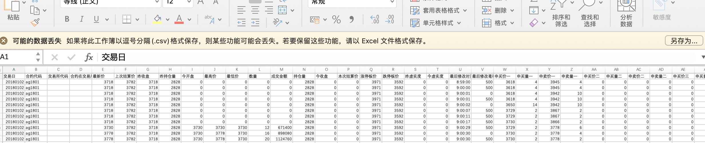
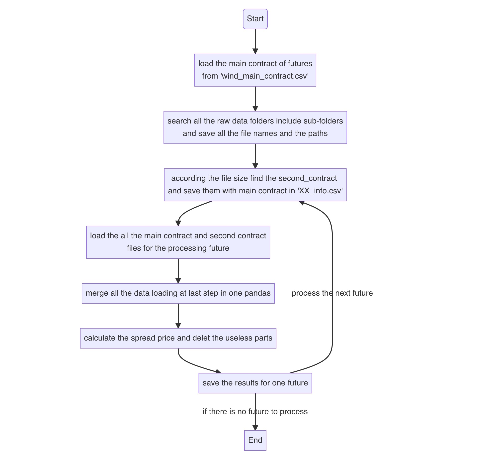
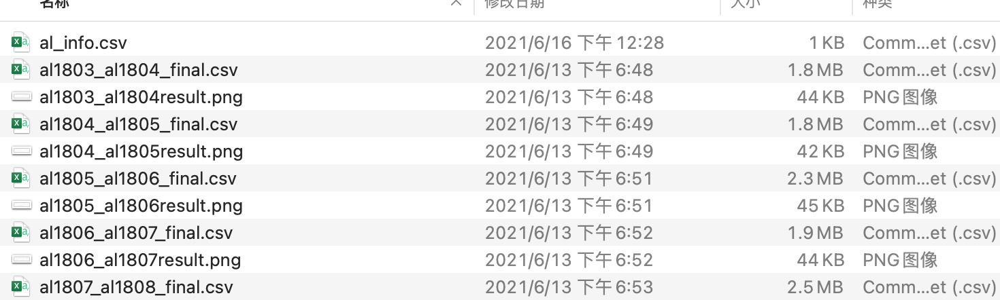
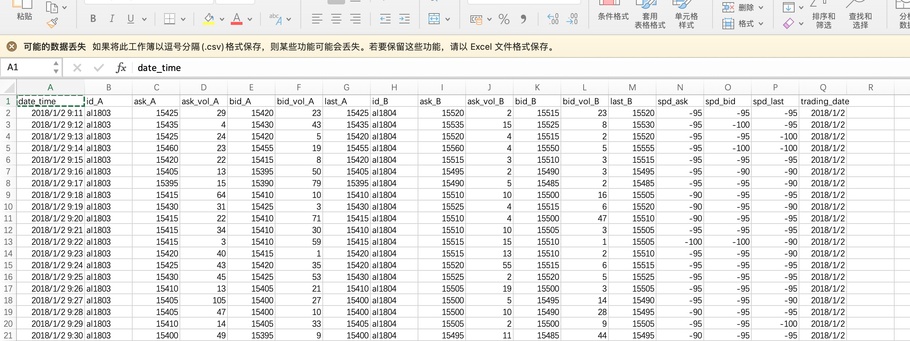

## Data cleaning

This module aims to process the raw data of Futures.

### Introduce to the raw data

The raw data I used in my strategies comes from the CTP interface. I bought it from the data collection company. The frequency of data is 2HZ, and divided them day by day. The basic folder structure of the data is like this:

And the basic data structure is like :

I have all the Futures' raw CTP data from 2016 to 2021 and they occupy a lot of store space of computer, so  I can't update them in the GitHub and other cloud space. If someone wants to get them, you can but it from any data company.

### The target structure of data

Because my purpose of research is building strategies for pair trading in inter-temporal futures, there are some points for how to transfer the data.

- We should generate the pair of two inter-temporal future contract in one file. We need find which two contracts of one future and use them to build the new data.
- Every data file need save the whole period of our target pair of contracts instead of one file with one day's data
- We should only keep the useful data in the files because the raw data have many useless data.
- We need calculate the spread prices for the pair of contracts, including spread ask/bid/ask type2/bid type2 price.
- We need to change the interval between the two data. The raw data's interval is 500ms, we can choose the 1mins or 10 mins to be our interval. The best way is we can very easily adjust this parameter.
- Put the same future contracts in a same folder. 
- We can generate a simple picture for every file, we can view the trend for it.
- We need be careful for the outlier(such as: nan value /error value) of the raw data, and tackle with them.

### The details for the code

According to the purpose above, I design the code to process the data. The flow chart is below:

The details' code please see the file: *"data_cleaning_1min.py"* and "*data_cleaning_10min.py"* .

### Result 

After processing, the program will generate the info file and data file and picture for each future. The demo result you can see in the folder "RESULT_ALL_1min/al", like this:

And the final data file structure is:

