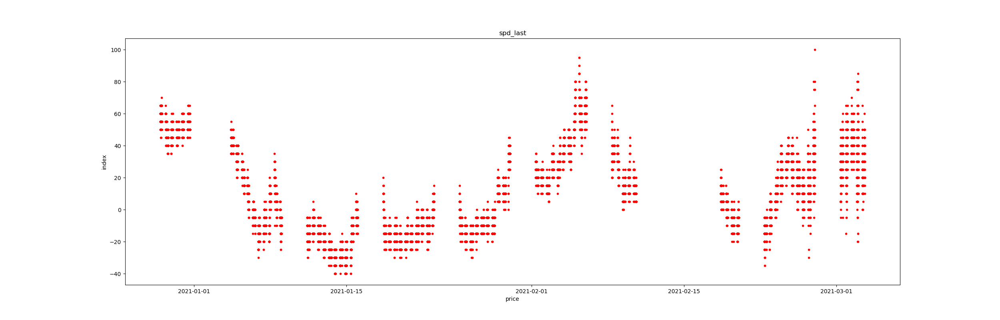

# Pair trading strategy by moving average

## Introduce 

The basic principle of interest arbitrage in the pair trading is very well know, I will not describe it. In this page I only write the coding process for my strategy.

After we clean all the raw data, we can get all the ask-bid spread price of the Futures. And then we can do the co-integration analysis for them. If a spread series has a character of stationary, we can use the features of stationary to build a strategy. 

First of all, we know a series with stationary has the property of mean recovery. Therefore, when we detect the spread price far away from the mean, that will be an opportunity to trading(open a position) this combination of futures' contracts. And when the spread price go back to the mean, we can close the position and we can make profit from it. 

There is a picture of a spread price of contracts of *"al 2103 - al 2104"*



And we also need a backtest for our strategy, so in the programer we use it to judge if our strategy is useful. If our strategy suits for a futures, we will run it on our pair trading system with simulation trading on the real time data and watch its performance. And if it's also well, we will use it.


## Coding analysis

*"Strategy_V5.py"* is one of the edition. If you are interested in them, you can find more in the folder of history.

```python
if __name__ == "__main__":
    trading_instrument = "al"
    dir_data_path = "RESULT_ALL_new"
    trade_start_date = datetime.datetime(2020, 5, 1)
    trade_end_date = datetime.datetime(2020,8, 1)
    #在这里定义交易参数：
    trading_setting = {
        'trading_delta_work_days':1,
        "train_data_work_days": 2,
        "instrument_tick_size": 5,
        "trading_cost": 1.2,
        "biggest_lost": -20,
        "biggest_profit": 10,
        "open_thro_k_std": 1,
        "close_thro_k_std": 0
    }
```

We can see that there are many parameters which we need set at the front of the code. The meaning of them is :

- "trading_instrument": which Futures we choose to analyst
- "dir_data_path": the data's storage path in your computer
- "trade_start_date" and "trade_end_date": trading date set for this simulation
- "trading_delta_work_days": the delta day we update our trading parameters
- "train_data_work_days": the period we use to train our trading parameters
- "instrument_tick_size": the tick size of the contract
- "trading_cost": the cost of trading one contract
- "biggest_lost": loss limit for one trading
- "biggest_profit": profit limit for one trading
- "open_thro_k_std": open position k times of the standard deviation
- "close_thro_k_std": close position k times of the standard deviation

After we set these parameters, we can get the result of our setting. As fo how to set these parameters, right I just follow my heart, and try it.

#### Flow charts for this code:

A : generate the trading parameters


B : backtest flow


#### Risks and Problems 


